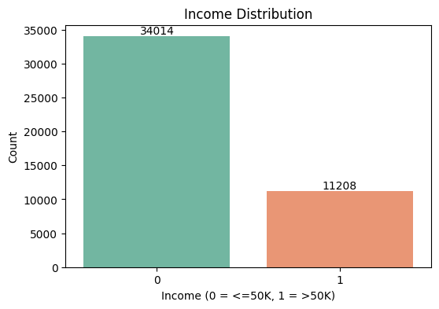
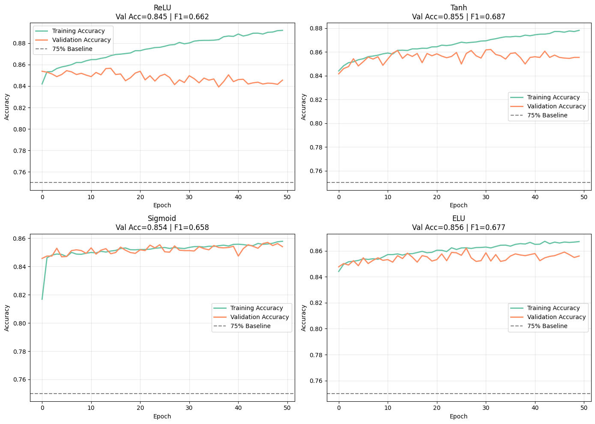
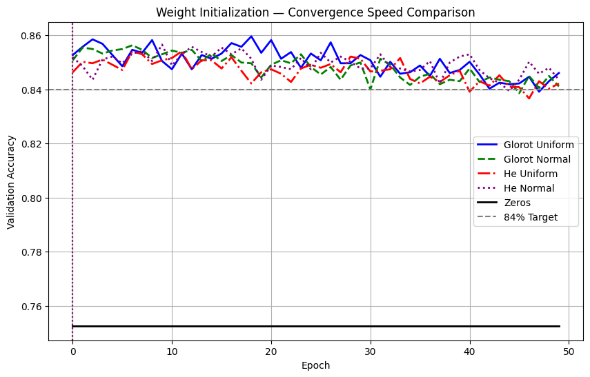
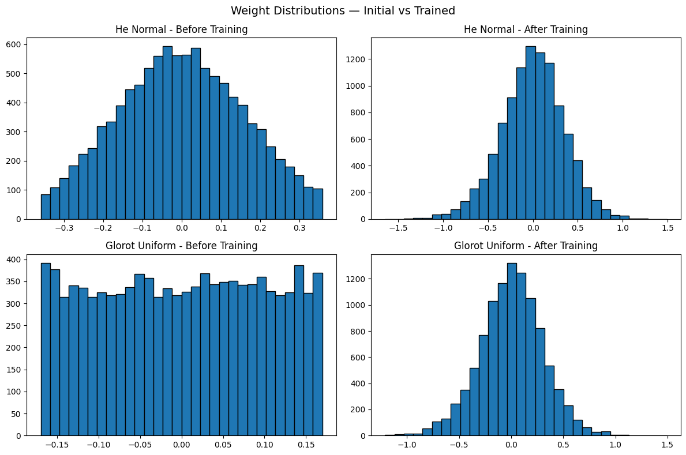
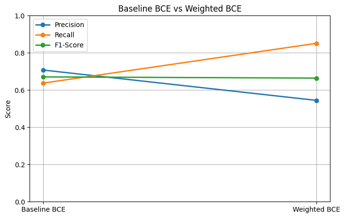
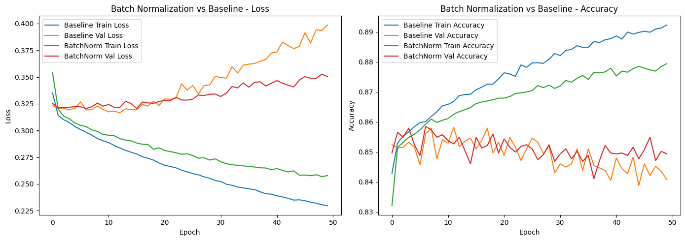
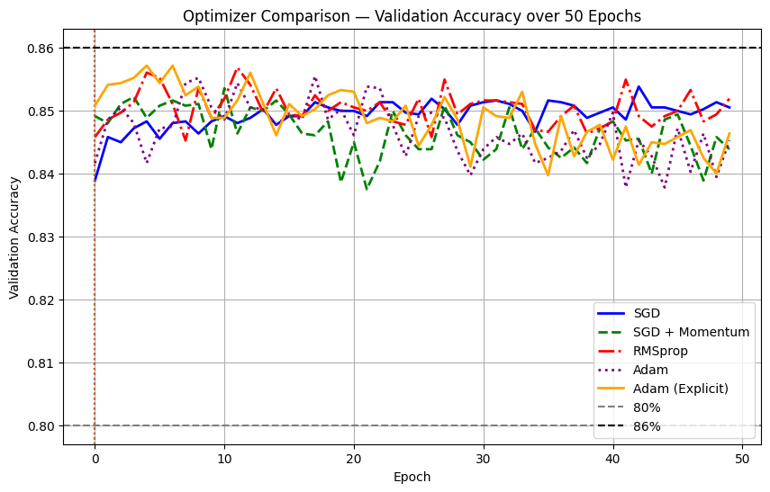
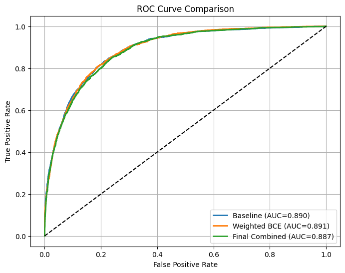

# 🧠 Adult Income Classification — Deep Learning ANN

**Predicting whether an individual earns above or below $50K/year using a fully-connected neural network, built from the ground up across activation functions, weight initialization, loss functions, batch normalization, and optimizers.**

<p align="center">
  
  
  
  
  
</p>

<p align="center">
  <em>Deep Learning · PR 2 — Red & White Skill Education</em>
</p>

---

## 📖 Table of Contents

- [Overview](#-overview)
- [Dataset](#-dataset)
- [Project Pipeline](#-project-pipeline)
- [Exploratory Data Analysis](#-exploratory-data-analysis)
- [Task 1 — Preprocessing](#task-1--data-cleaning--preprocessing)
- [Task 2 — Baseline ANN](#task-2--baseline-ann-architecture)
- [Task 3 — Activation Functions](#task-3--activation-function-comparison)
- [Task 4 — Weight Initialization](#task-4--weight-initialization)
- [Task 5 — Loss Functions](#task-5--loss-functions)
- [Task 6 — Batch Normalization](#task-6--batch-normalization)
- [Task 7 — Optimizers & Final Model](#task-7--optimizers--final-model)
- [Final Results](#-final-results-comparison)
- [Repository Structure](#-repository-structure)
- [Tools & Libraries](#-tools--libraries)
- [How to Run](#-how-to-run)
- [Video Walkthrough](#-video-walkthrough)
- [Author](#-author)

---

## 🎯 Overview

| | |
|---|---|
| **Task Type** | Binary Classification |
| **Target** | `income` — `<=50K` (0) vs `>50K` (1) |
| **Framework** | TensorFlow 2.x / Keras + scikit-learn |
| **Core Deliverable** | Single Jupyter Notebook — `DL_PR2.ipynb` |
| **Topics Covered** | MLP · Activation Functions · Weight Initialization · Loss Functions · Batch Normalization · Optimizers |

The goal isn't just to hit a good accuracy score — it's to isolate **one design choice at a time** (activation, initializer, loss, normalization, optimizer) through controlled experiments built on a single reusable `build_ann()` function, and understand *why* each one moves the needle on an imbalanced, real-world tabular dataset.

---

## 📊 Dataset

**Adult Income Dataset (Census Income)** — extracted from the 1994 US Census database, donated to the UCI Machine Learning Repository.

| Field | Detail |
|---|---|
| Source | [UCI Machine Learning Repository](https://archive.ics.uci.edu/dataset/2/adult) · [Kaggle Mirror](https://www.kaggle.com/datasets/wenruliu/adult-income-dataset) |
| Raw Size | 48,842 rows × 15 columns |
| After Cleaning | 45,222 rows × 13 columns |
| Features | 6 numeric + 8 categorical → ~95–105 columns after one-hot encoding |
| Target | `income` — binary, `>50K` = 1, `<=50K` = 0 |
| Class Balance | 34,014 (`<=50K`, ~75%) vs 11,208 (`>50K`, ~25%) — **imbalanced** |
| Missing Values | Encoded as `?` in `workclass`, `occupation`, `native-country` |
| License | CC BY 4.0 |

> ⚖️ **Why this matters:** with a ~3:1 class imbalance, a model that always predicts "0" scores ~75% accuracy while being useless. Every experiment in this project tracks **Precision, Recall, and F1-score for class 1** alongside accuracy.

---

## 🔄 Project Pipeline

```
Raw CSV → Clean & Encode → Baseline ANN → Activation Sweep → Initializer Sweep
        → Loss Function Sweep → Batch Normalization → Optimizer Sweep → Final Model
```

Every experiment calls the same reusable function:

```python
def build_ann(input_dim, hidden_units=[128, 64], activation='relu',
              initializer='glorot_uniform', use_batch_norm=False,
              optimizer='adam', loss='binary_crossentropy'):
    ...
    return model
```

This enforces **controlled experiments** — one variable changes at a time, everything else stays fixed.

---

## 📈 Exploratory Data Analysis

**Preprocessing steps applied:**
- Stripped whitespace from all string columns
- Replaced `?` with `NaN`, dropped rows with missing values (48,842 → 45,222 rows)
- Dropped `fnlwgt` (sampling weight, non-predictive) and `education` (redundant with `educational-num`)
- Encoded target: `>50K` → 1, `<=50K` → 0
- One-hot encoded all categorical columns (`drop_first=True`)
- Applied `StandardScaler` to numeric columns only — **not** to one-hot binary columns
- Stratified 80/20 train-test split (`random_state=42`)

<p align="center">
  
</p>

<p align="center"><em>Target class distribution — the ~75/25 split motivates tracking F1-score alongside accuracy throughout.</em></p>

---

## Task 1 · Data Cleaning & Preprocessing

- ✅ Missing-value handling (`?` → `NaN` → dropped)
- ✅ Redundant column removal (`fnlwgt`, `education`)
- ✅ Target binarization
- ✅ 4 EDA visualizations (age histogram, hours boxplot, education countplot, correlation heatmap)
- ✅ One-hot encoding + `StandardScaler` + stratified split

---

## Task 2 · Baseline ANN Architecture

**Architecture:** `Dense(128, ReLU) → Dense(64, ReLU) → Dense(1, Sigmoid)`

A single sigmoid output neuron is used instead of a 2-neuron softmax — for binary classification it's more parameter-efficient and maps the logit directly to `P(income > 50K)`.

| Metric | Value |
|---|---|
| Test Accuracy | **84.5%** |
| F1-Score (class 1) | **0.671** |
| ROC-AUC | **0.890** |

---

## Task 3 · Activation Function Comparison

Trained **ReLU, Tanh, Sigmoid, and ELU** as hidden-layer activations (50 epochs each), plus diagnostics:
- **Dead neuron check** on ReLU — fraction of neurons stuck outputting zero
- **Gradient flow check** on Sigmoid — per-layer gradient magnitude via `GradientTape`, exposing vanishing gradients

<p align="center">
  
</p>

| Activation | Zero-Centred | Vanishing Gradient Risk | Dead Neuron Risk |
|---|---|---|---|
| ReLU | ❌ | Low | **High** |
| Tanh | ✅ | Medium | Low |
| Sigmoid | ❌ | **High** | Low |
| ELU | Partial | Low | **None** |

**Winner: ELU** — best validation F1 (0.677) with no dead-neuron failure mode.

---

## Task 4 · Weight Initialization

Compared **Glorot Uniform, Glorot Normal, He Uniform, He Normal, and Zeros** across 50 epochs, including a dedicated *zeros-initialization failure demonstration* (the network gets stuck at ~75% — the majority-class baseline — because symmetric weights never break symmetry).

<p align="center">
  
</p>

<p align="center">
  
</p>

**Winner: He Normal** — designed for ReLU (`Var = 2/fan_in`), converges fastest and reaches the highest accuracy among non-zero initializers.

---

## Task 5 · Loss Functions

Compared **Binary Cross-Entropy, MSE (as a classification loss — the "wrong tool" experiment), Weighted BCE, and Focal Loss** for handling the 75/25 class imbalance.

<p align="center">
  
</p>

| Loss Function | Best For | F1 (class 1) |
|---|---|---|
| BCE | Balanced binary classification | 0.646 |
| MSE | *(not recommended — vanishing gradient at saturation)* | lower |
| **Weighted BCE** | **Imbalanced data, recall-sensitive** | **0.664** |
| Focal Loss | Extreme imbalance, hard-example mining | 0.554 |

Weighted BCE trades some precision for a large recall gain — valuable when missing a high-earner (false negative) is costlier than a false positive.

---

## Task 6 · Batch Normalization

Built `Dense → BatchNormalization → Activation` (canonical order per Ioffe & Szegedy, 2015) to counter **Internal Covariate Shift**, and compared it against a no-BN baseline plus a before-vs-after-activation placement experiment.

<p align="center">
  
</p>

BatchNorm produces a tighter train–validation gap and faster convergence, at the cost of extra (mostly non-trainable) parameters for the running mean/variance statistics.

---

## Task 7 · Optimizers & Final Model

Compared **SGD, SGD+Momentum, RMSprop, Adam, and explicit Adam** on the strongest configuration so far (ReLU + He Normal + BatchNorm), plus a learning-rate sensitivity sweep (7 models: 4 SGD rates × 3 Adam rates).

<p align="center">
  
</p>

**Adam wins** — its adaptive per-parameter learning rates make it far more robust to learning-rate choice than SGD, which needs careful tuning to avoid diverging or stalling on the high-dimensional one-hot feature space.

### 🏆 Final Combined Model

`Dense(128, He Normal) → BatchNorm → ReLU → Dense(64, He Normal) → BatchNorm → ReLU → Dense(1, Sigmoid)` trained for 80 epochs with Adam + Weighted BCE.

| Metric | Value |
|---|---|
| Accuracy | **78.9%** |
| Precision (class 1) | 0.548 |
| **Recall (class 1)** | **0.835** |
| F1-Score (class 1) | 0.662 |
| **ROC-AUC** | **0.887** |

---

## 📊 Final Results Comparison

<p align="center">
  
</p>

| Model | Activation | Initializer | Loss | BatchNorm | Optimizer | Test Acc | Precision | Recall | **F1(1)** | **ROC-AUC** |
|---|---|---|---|---|---|---|---|---|---|---|
| Baseline | ReLU | Glorot Uniform | BCE | No | Adam | 0.845 | 0.707 | 0.637 | 0.671 | 0.890 |
| Best Activation (ELU) | ELU | Glorot Uniform | BCE | No | Adam | 0.851 | 0.729 | 0.633 | **0.677** | 0.907 |
| Best Initializer (He Normal) | ReLU | He Normal | BCE | No | Adam | 0.839 | 0.708 | 0.593 | 0.646 | 0.887 |
| Weighted BCE | ReLU | He Normal | Weighted BCE | No | Adam | 0.787 | 0.545 | **0.851** | 0.664 | 0.891 |
| Focal Loss | ReLU | He Normal | Focal Loss | No | Adam | 0.827 | **0.765** | 0.434 | 0.554 | 0.884 |
| BatchNorm | ReLU | He Normal | BCE | Yes | Adam | 0.843 | 0.723 | 0.593 | 0.651 | 0.897 |
| **Final Combined** | ReLU | He Normal | Weighted BCE | Yes | Adam | 0.789 | 0.548 | 0.835 | 0.662 | 0.887 |

> 🔍 **Key takeaway:** the **Activation choice (ELU)** delivered the single largest F1/ROC-AUC gain among individual techniques, while **Weighted BCE** delivered the largest gain in **minority-class recall** — the more business-relevant metric for income-targeting use cases where missing a high earner is costlier than a false alarm.

---

## 📁 Repository Structure

```
├── DL_PR2.ipynb              # Full notebook — all 7 tasks, Restart & Run All clean
├── DL_PR2.html                # Exported HTML version of the notebook
├── adult.csv                  # Dataset (UCI/Kaggle Adult Income)
├── requirements.txt           # Python dependencies
├── plots/                     # All key figures, clearly named
│   ├── eda_class_balance.png
│   ├── activation_comparison.png
│   ├── initialiser_convergence.png
│   ├── weight_distributions.png
│   ├── loss_f1_comparison.png
│   ├── batchnorm_dynamics.png
│   ├── optimiser_convergence.png
│   ├── roc_curves.png
│   └─  etc.
└── README.md                  # You are here
```

---

## 🛠 Tools & Libraries

| Library | Purpose |
|---|---|
| `pandas`, `numpy` | Data loading & manipulation |
| `matplotlib`, `seaborn` | Visualization |
| `scikit-learn` | Preprocessing, splitting, metrics, class weighting |
| `tensorflow` / `keras` | Model building & training |

```
numpy>=1.23
pandas>=1.5
matplotlib>=3.6
seaborn>=0.12
scikit-learn>=1.2
tensorflow>=2.12
```

---

## ▶️ How to Run

```bash
# Clone the repository
git clone https://github.com/<your-username>/<your-repo-name>.git
cd <your-repo-name>

# Install dependencies
pip install -r requirements.txt

# Launch the notebook
jupyter notebook DL_PR2.ipynb
```

Run all cells top-to-bottom (**Kernel → Restart & Run All**) to reproduce every result and plot above.

---

## 🎥 Video Walkthrough

📺 **[Watch the full explanation here](https://drive.google.com/file/d/18s3zJKoSonC8pJvLbP4GhAB4P8dW3MpZ/view?usp=sharing)** — face + screen recording covering preprocessing rationale, sigmoid vs softmax, activation diagnostics, initializer theory, BCE vs Focal Loss, BatchNorm's Internal Covariate Shift fix, and why Adam wins.

---

## 👤 Author

**Krisha**
Data Science Student

🔗 [LinkedIn](https://www.linkedin.com/in/krisha-anghan-bb1179382/) &nbsp;·&nbsp; [GitHub](https://github.com/krisha12345819)

---

<p align="center"><em>Built as part of the Deep Learning · PR 2 project</em></p>
