<div align="center">

# 🧠 Adult Income Classification with a Custom ANN
### Deep Learning · PR 2 — Red & White Skill Education

**MLP · Activation Functions · Weight Initialization · Loss Functions · Batch Normalization · Optimizers**

[](https://www.python.org/)
[](https://www.tensorflow.org/)
[](https://keras.io/)
[](https://scikit-learn.org/)
[]()
[]()

</div>

---

## 📌 Overview

This project builds a fully-connected **Artificial Neural Network (MLP)** in TensorFlow/Keras to predict whether an individual's annual income exceeds **$50K**, using the classic **Adult / Census Income dataset**. Rather than training one model and stopping, the notebook runs **7 structured experiments** — architecture, activations, initializers, loss functions, batch normalization, and optimizers — each isolating **one variable at a time**, so every design choice in the final model is backed by evidence instead of guesswork.

> 🎯 **Goal:** Not just *build a classifier*, but understand **why** each component (activation, initializer, loss, normalization, optimizer) behaves the way it does on real, imbalanced, tabular data.

---

## 📚 Table of Contents

- [Dataset](#-dataset)
- [Preprocessing Pipeline](#-preprocessing-pipeline)
- [Topics Covered](#-topics-covered)
- [The `build_ann()` Function](#-the-build_ann-function)
- [Results Gallery](#-results-gallery)
- [Final Results Table](#-final-results-comparison)
- [Key Takeaways](#-key-takeaways)
- [Repository Structure](#-repository-structure)
- [Tools & Libraries](#-tools--libraries)
- [How to Run](#-how-to-run)
- [Video Walkthrough](#-video-walkthrough)

---

## 📊 Dataset

| Field | Detail |
|---|---|
| **Name** | Adult Income Dataset (Census Income) |
| **Source** | [UCI Machine Learning Repository](https://archive.ics.uci.edu/dataset/2/adult) · [Kaggle mirror](https://www.kaggle.com/datasets/wenruliu/adult-income-dataset) |
| **Rows** | 48,842 records → **45,222** after cleaning |
| **Features** | 14 input features (6 numeric, 8 categorical) |
| **Target** | `income` → `<=50K` = 0, `>50K` = 1 |
| **Class Balance** | **34,014** (`0`) vs **11,208** (`1`) → ~75% / 25% — **imbalanced** |
| **License** | CC BY 4.0 |

<div align="center">


*The ~3:1 imbalance is why **F1-score, Precision, and Recall** are tracked for the minority class throughout — accuracy alone is misleading (predicting "0" always scores ~75%).*
</div>

---

## 🧹 Preprocessing Pipeline

```
adult.csv
   │
   ├─ strip whitespace from all string columns
   ├─ replace '?' → NaN                     (workclass, occupation, native-country)
   ├─ drop rows with any NaN                 → 45,222 rows remain
   ├─ drop 'fnlwgt' (sampling weight) + 'education' (redundant w/ educational-num)
   ├─ encode target: '>50K' → 1, '<=50K' → 0
   ├─ One-Hot Encode categoricals            pd.get_dummies(drop_first=True)
   ├─ StandardScaler on numeric columns ONLY (age, educational-num, capital-gain/loss, hours-per-week)
   └─ stratified train_test_split            test_size=0.2, random_state=42
```

**Why drop instead of impute?** The missing columns are categorical with many categories — mode imputation would disproportionately inflate the most common category and bias the model.

| Plot | Description |
|---|---|
| 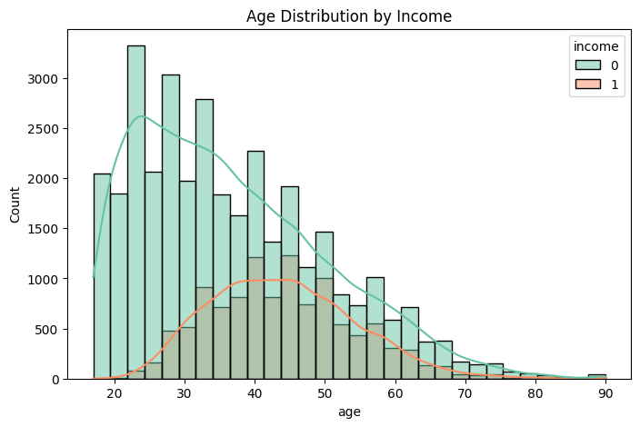 | **Age vs. Income** — Income >$50K peaks in the middle-age (35–55) range, consistent with career/seniority progression. |
| 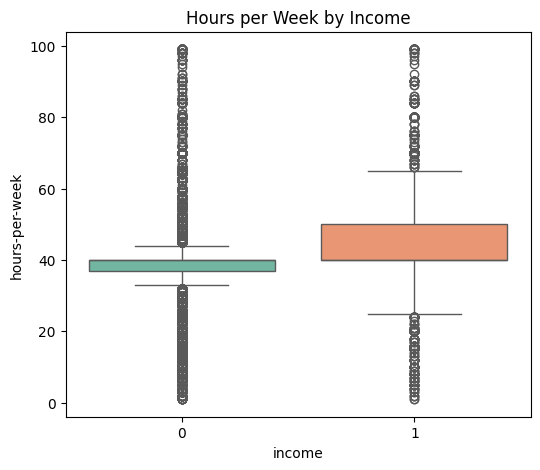 | **Hours/Week vs. Income** — Higher earners consistently work more hours per week. |
| 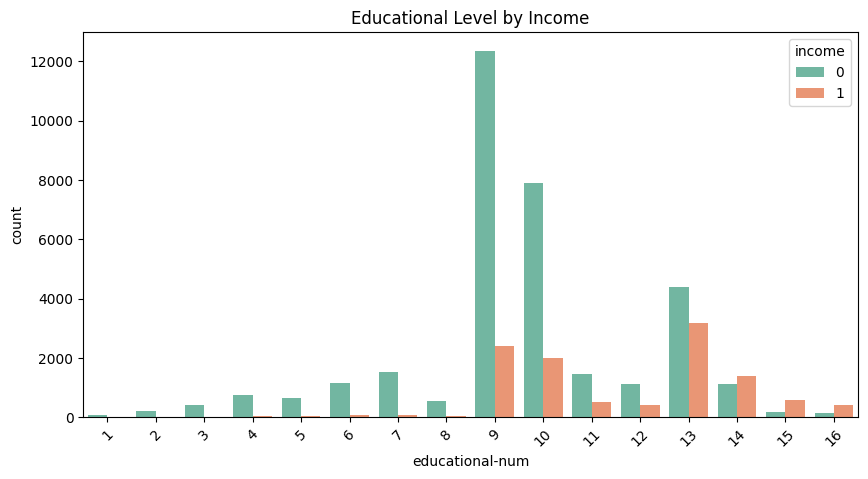 | **Education vs. Income** — Higher `educational-num` strongly correlates with the >50K class. |
| 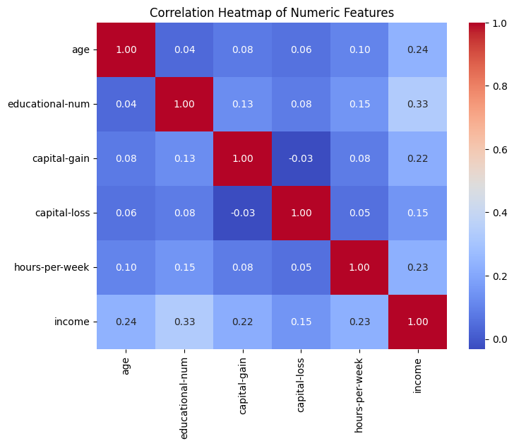 | **Correlation Heatmap** — Numeric features show moderate correlation with income; no severe multicollinearity. |

---

## 🧪 Topics Covered

| # | Topic | What Was Tested |
|---|---|---|
| 1 | **Baseline MLP** | `Dense(128, ReLU) → Dense(64, ReLU) → Dense(1, Sigmoid)`, trained 50 epochs with Adam + BCE. |
| 2 | **Activation Functions** | ReLU vs Tanh vs Sigmoid vs ELU — dead-neuron diagnosis (ReLU) and vanishing-gradient diagnosis (Sigmoid, via `GradientTape`). |
| 3 | **Weight Initialization** | Glorot Uniform/Normal, He Uniform/Normal, and **Zeros** — demonstrating the symmetry-breaking problem. |
| 4 | **Loss Functions** | Binary Cross-Entropy vs MSE vs **Weighted BCE** (`compute_class_weight`) vs custom **Focal Loss** (γ=2.0, α=0.25) for class imbalance. |
| 5 | **Batch Normalization** | Dense→BN→Activation (canonical) vs Dense→Activation→BN, plus learned γ/β inspection. |
| 6 | **Optimizers** | SGD, SGD+Momentum, RMSprop, Adam (default), Adam (explicit) — plus learning-rate sensitivity sweep. |
| 7 | **Final Combined Model** | Best configuration across all experiments, evaluated with Accuracy, Precision, Recall, F1, and ROC-AUC. |

---

## ⚙️ The `build_ann()` Function

A single reusable factory function underlies every experiment — changing **one parameter at a time** enforces a controlled comparison across all 7 tasks.

```python
def build_ann(input_dim,
              hidden_units=[128, 64],
              activation='relu',
              initializer='glorot_uniform',
              use_batch_norm=False,
              optimizer='adam',
              loss='binary_crossentropy'):
    ...
    return model   # compiled keras.Sequential
```

| Parameter | Default | Purpose |
|---|---|---|
| `input_dim` | — | Number of input features after OHE (≈ 100) |
| `hidden_units` | `[128, 64]` | Widths of the two hidden Dense layers |
| `activation` | `'relu'` | Hidden-layer activation function |
| `initializer` | `'glorot_uniform'` | Weight initialization scheme |
| `use_batch_norm` | `False` | Insert `BatchNormalization` after each Dense layer |
| `optimizer` | `'adam'` | Optimization algorithm |
| `loss` | `'binary_crossentropy'` | Loss function (BCE / MSE / weighted BCE / focal) |

**Baseline architecture:** 18,689 total trainable parameters — `(input_dim×128+128) + (128×64+64) + (64×1+1)`.

---

## 🖼️ Results Gallery

<details open>
<summary><strong>🔹 Task 2 — Baseline ANN</strong></summary>
<br>

| Training Curves | Confusion Matrix |
|---|---|
| 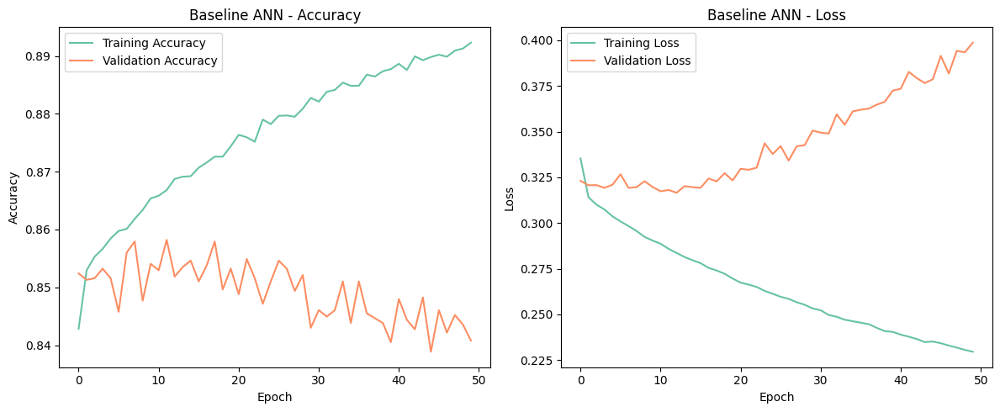 | 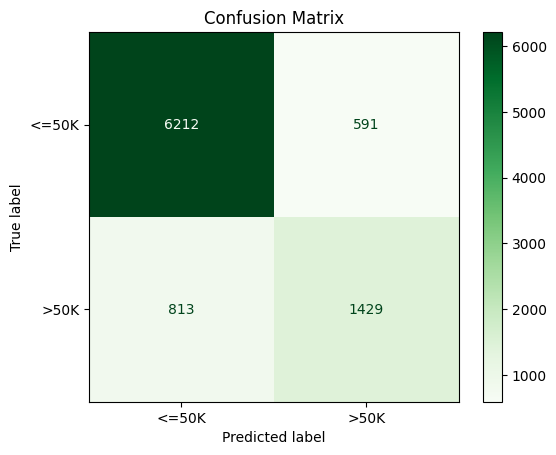 |

Test **Precision(1) = 0.71 · Recall(1) = 0.64 · F1(1) = 0.67** — a solid baseline, but Recall on the minority (high-income) class leaves room to improve.
</details>

<details open>
<summary><strong>🔹 Task 3 — Activation Functions</strong></summary>
<br>

<div align="center"></div>

| Diagnostic | Plot |
|---|---|
| ReLU Dead Neuron Check — **61.96%** of first-layer neurons were inactive on the test batch | 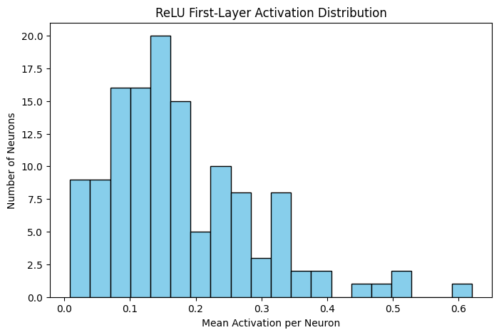 |
| Sigmoid Gradient Magnitude by Layer — Layer 1 gradients (~0.0002) are ~27× smaller than Layer 3 (~0.0056), a textbook vanishing-gradient signature | 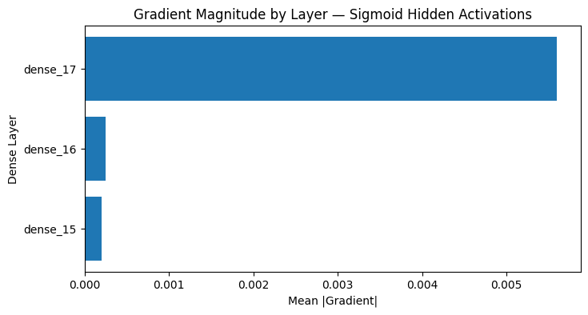 |

**ELU** edged out ReLU on this run (higher F1 and ROC-AUC) by keeping the gradient path alive for negative pre-activations.
</details>

<details open>
<summary><strong>🔹 Task 4 — Weight Initialization</strong></summary>
<br>

| Convergence Speed | Zeros-Init Failure |
|---|---|
|  | 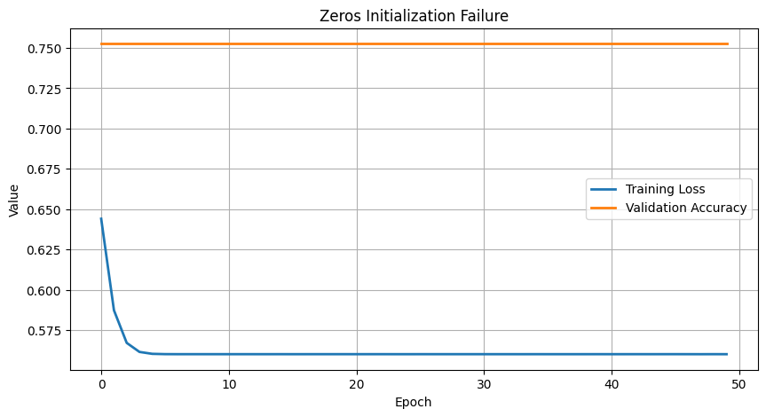 |

<div align="center"></div>

The **all-zeros** model stays flat near the ~75% majority-class baseline — a direct demonstration of the symmetry problem: every neuron in a layer receives identical gradients and never differentiates.
</details>

<details open>
<summary><strong>🔹 Task 5 — Loss Functions</strong></summary>
<br>

| BCE vs MSE (F1) | Weighted BCE vs Baseline | Focal Loss vs Weighted BCE |
|---|---|---|
| 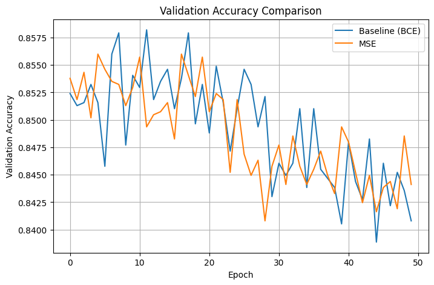 |  | 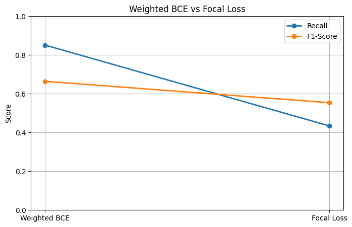 |

**Weighted BCE** pushes minority-class **Recall up to 0.85** (from 0.64) at the cost of Precision — the right trade-off when *missing* a high-earner is more costly than a false positive. **Focal Loss** under-performed here, over-suppressing "easy" majority examples.
</details>

<details open>
<summary><strong>🔹 Task 6 — Batch Normalization</strong></summary>
<br>

| With vs Without BN | BN Position: Before vs After Activation |
|---|---|
|  | 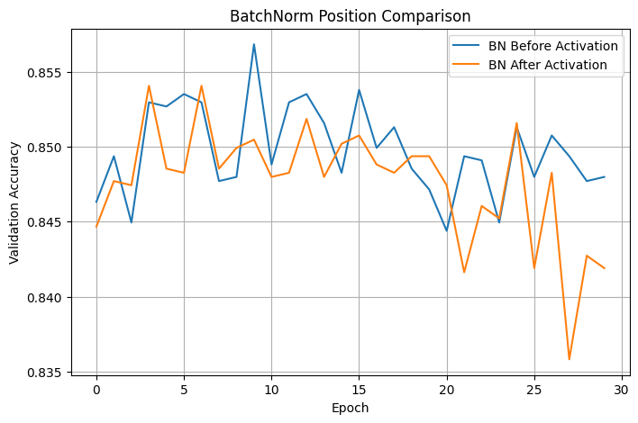 |

| Learned γ (scale) | Learned β (shift) |
|---|---|
| 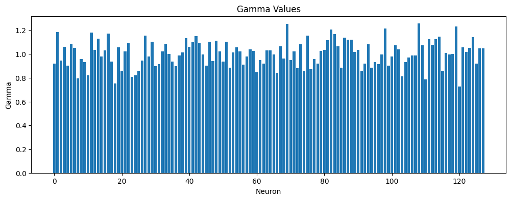 | 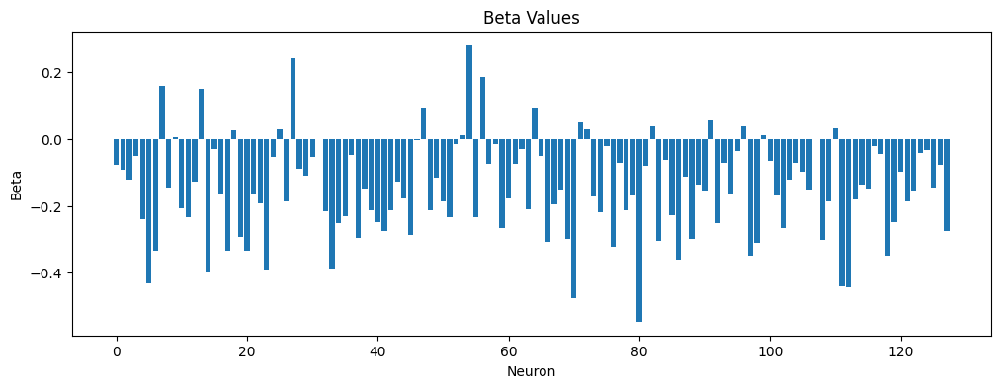 |

Neurons with `\|γ\|` near zero have been effectively gated off by the network — their pre-activation signal carries little predictive value for income.
</details>

<details open>
<summary><strong>🔹 Task 7 — Optimizers</strong></summary>
<br>

| Optimizer Convergence | Learning-Rate Sensitivity (SGD vs Adam) |
|---|---|
|  | 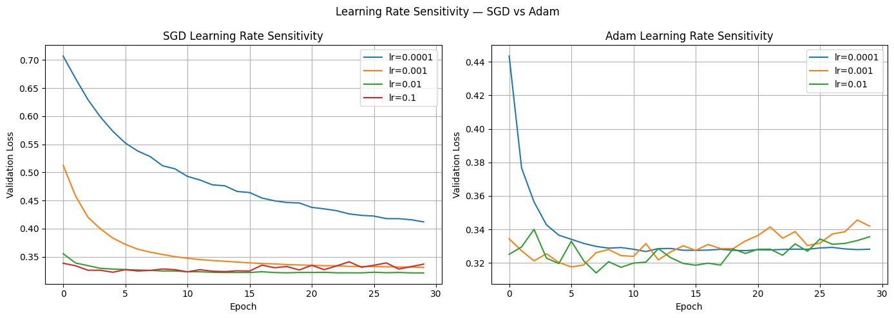 |

<div align="center"></div>

**Adam** converges fastest and most reliably across learning rates — its per-parameter adaptive steps handle the sparse, high-dimensional one-hot feature space far better than vanilla SGD.
</details>

---

## 🏆 Final Results Comparison

| Model | Activation | Initializer | Loss | BatchNorm | Optimizer | Test Acc | Precision(1) | Recall(1) | **F1(1)** | ROC-AUC |
|---|---|---|---|---|---|---|---|---|---|---|
| Baseline | ReLU | Glorot Uniform | BCE | No | Adam | 0.8448 | 0.7074 | 0.6374 | 0.6706 | 0.8904 |
| Best Activation | **ELU** | Glorot Uniform | BCE | No | Adam | 0.8506 | 0.7288 | 0.6329 | **0.6775** | **0.9067** |
| Best Initializer | ReLU | He Normal | BCE | No | Adam | 0.8386 | 0.7082 | 0.5932 | 0.6456 | 0.8870 |
| Weighted BCE | ReLU | He Normal | Weighted BCE | No | Adam | 0.7866 | 0.5445 | **0.8510** | 0.6641 | 0.8910 |
| Focal Loss | ReLU | He Normal | Focal Loss | No | Adam | 0.8266 | **0.7649** | 0.4340 | 0.5538 | 0.8843 |
| BatchNorm | ReLU | He Normal | BCE | Yes | Adam | 0.8427 | 0.7227 | 0.5928 | 0.6513 | 0.8973 |
| Final Combined | ReLU | He Normal | Weighted BCE | Yes | Adam | 0.7885 | 0.5481 | 0.8354 | 0.6620 | 0.8866 |

> 🥇 **Highest F1(1) & ROC-AUC:** *Best Activation (ELU)* configuration.
> 🥈 **Highest Recall(1):** *Weighted BCE* — best choice when catching every high-earner matters more than precision.

---

## 💡 Key Takeaways

- **Class imbalance dominates the story.** Every technique that reweights the loss toward the minority class (Weighted BCE, Focal Loss) trades Precision for Recall — the "best" model depends on the business cost of a false negative vs a false positive.
- **Activation choice had the single largest effect on minority-class F1** among the individually-tested factors — ELU's non-zero gradient for negative inputs avoided the 62% dead-neuron rate seen with plain ReLU.
- **Zero initialization is a hard failure, not a minor inefficiency** — the network never breaks symmetry and gets stuck predicting the majority class.
- **He/Glorot initialization + Adam** together give the fastest, most stable convergence on this sparse, high-dimensional (≈100-column) one-hot feature space.
- **Batch Normalization** tightened the train/validation gap and stabilized training, though its raw accuracy gain was modest on this particular tabular dataset.

---

## 🗂️ Repository Structure

```
.
├── DL_PR2.ipynb              # Full notebook — all 7 tasks, Restart & Run All clean
├── DL_PR2.html                # Exported HTML version of the notebook
├── adult.csv                  # Dataset (UCI / Kaggle Adult Income)
├── requirements.txt           # Python dependencies
├── README.md                  # You are here
└── plots/
    ├── eda_class_balance.png
    ├── eda_age_by_income.png
    ├── eda_hours_by_income.png
    ├── eda_education_by_income.png
    ├── eda_correlation_heatmap.png
    ├── baseline_training_curves.png
    ├── baseline_confusion_matrix.png
    ├── activation_comparison.png
    ├── relu_dead_neuron_histogram.png
    ├── sigmoid_gradient_magnitude.png
    ├── initialiser_convergence.png
    ├── zeros_init_failure.png
    ├── weight_distributions.png
    ├── mse_vs_bce_f1.png
    ├── weighted_bce_comparison.png
    ├── focal_loss_comparison.png
    ├── batchnorm_dynamics.png
    ├── batchnorm_position_experiment.png
    ├── batchnorm_gamma.png
    ├── batchnorm_beta.png
    ├── optimiser_convergence.png
    ├── lr_sensitivity.png
    └── roc_curves.png
```

---

## 🛠️ Tools & Libraries

<div align="left">


</div>

```
tensorflow>=2.12.0
scikit-learn>=1.4.0
pandas
numpy
matplotlib
seaborn
```

---

## ▶️ How to Run

```bash
# 1. Clone the repository
git clone https://github.com/<your-username>/DL_PR2-Adult-Income-ANN.git
cd DL_PR2-Adult-Income-ANN

# 2. Install dependencies
pip install -r requirements.txt

# 3. Download adult.csv from Kaggle/UCI (see Dataset section) into the repo root

# 4. Launch the notebook
jupyter notebook DL_PR2.ipynb
# Kernel → Restart & Run All
```

---

## 🎥 Video Walkthrough

📺 **Watch here:** `<paste your Google Drive / YouTube (unlisted) video link here>`

*A 5–10 min walkthrough covering: preprocessing rationale, sigmoid vs softmax, activation diagnostics (dead neurons / vanishing gradients), weight-initialization theory, BCE vs Focal Loss, Batch Normalization's Internal Covariate Shift, and why Adam outperforms SGD on this feature space.*

---

<div align="center">

**Red & White Skill Education** · *Since 2008* · "Shaping Skills for Scaling Higher"

⭐ If this project helped you understand ANN fundamentals, consider starring the repo!

</div>
